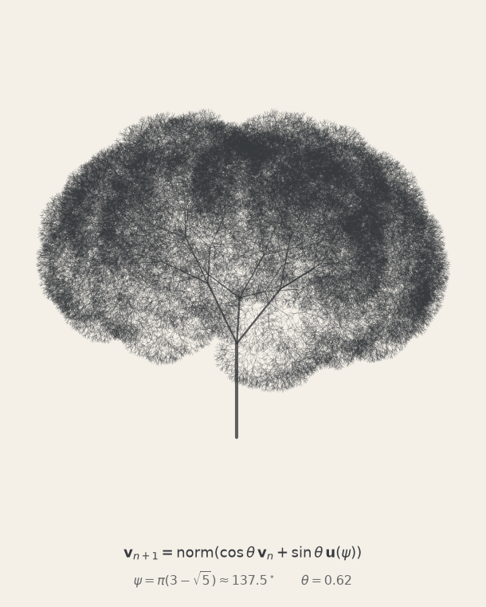
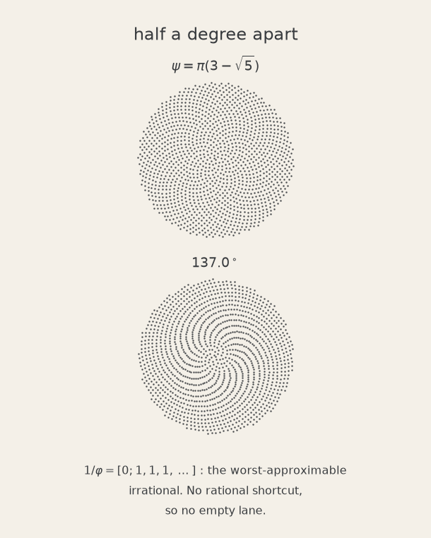
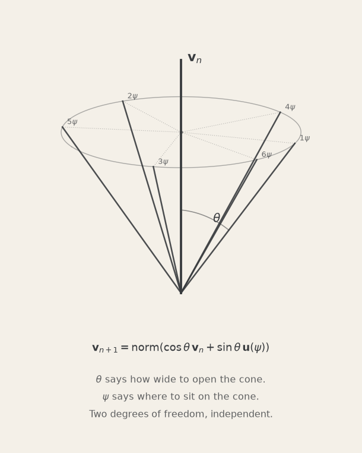
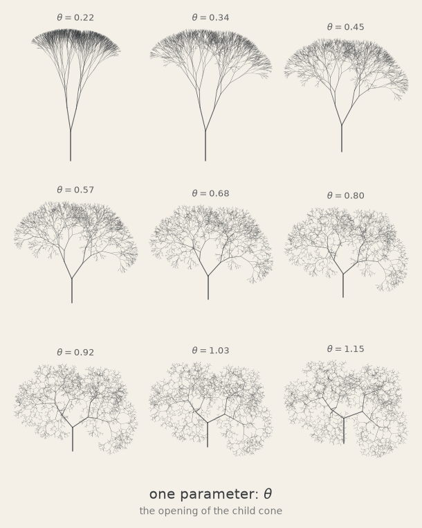
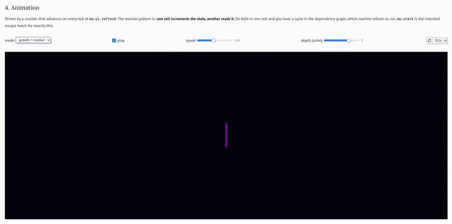

# 🌲 Fractal Tree

Golden-angle fractal trees in 3D. Two formulas generate the whole thing, and a
reactive [marimo](https://marimo.io/) notebook takes them apart with every
parameter on a slider.

$$
\psi = \pi(3-\sqrt5) \approx 137.5^\circ
\qquad
\mathbf v_{n+1} = \mathrm{norm}\big(\cos\theta\,\mathbf v_n + \sin\theta\,\mathbf u(\psi)\big)
$$

<p align="center">
  
  
</p>
<p align="center">
  
  
</p>

## Run it

```bash
uv run marimo edit fractal_tree.py
```

Move `theta` and the tree rebuilds itself.

<!-- An animated GIF is the only thing GitHub plays inline: it strips <video>
     when the src is a relative repo path. docs/3d_fractal_tree.mp4 is the
     source clip, kept for regenerating this and for a real player later. -->

<p align="center">
  
</p>

App mode, without the code showing:

```bash
uv run marimo run fractal_tree.py
```

The notebook declares its dependencies inline (PEP 723), so it also runs
standalone in a throwaway venv, nothing installed:

```bash
uvx marimo edit --sandbox fractal_tree.py
```

Static page that runs entirely in the browser via Pyodide, working sliders and
no server:

```bash
uv run marimo export html-wasm fractal_tree.py -o dist --mode run
```

## The maths

### Why 137.5°

If every branch rotates by a fixed angle $\alpha$ around its parent, branches
collide whenever $\alpha/2\pi$ is close to a rational $p/q$: after $q$ steps you
are back where you started, leaving $q$ crowded lanes and empty space between
them. Being irrational is not enough either. $137.0°$ is irrational in radians,
but $137/360 \approx 19/50$, so the lanes show up after ~50 branches.

What you want is the **worst-approximable** number, and that is a precise notion.
The continued fraction

$$
\frac{1}{\varphi} = [0;1,1,1,1,\dots]
$$

has every term equal to 1, the smallest possible: no term is ever large, and a
large term is exactly what produces a good rational approximation (π = [3;7,15,**292**,…],
which is why 355/113 is so accurate). Hurwitz's theorem makes it a theorem
rather than an intuition. For every irrational $\alpha$ there are infinitely
many $p/q$ with

$$
\left|\alpha - \frac{p}{q}\right| < \frac{1}{\sqrt5\,q^2}
$$

and the constant $\sqrt5$ cannot be improved, with equality only for numbers
equivalent to $\varphi$. No rational shortcut, so no empty lane. The three-gap
theorem closes the loop geometrically: the first $n$ points $\{k\alpha\}$ cut the
circle into at most three distinct gap lengths, and for the golden angle the
ratio between largest and smallest is the minimum over all irrationals.

Same reason sunflowers use it, and why you count 13, 21 or 34 spirals in a head:
the convergents are ratios of Fibonacci numbers.

Three spellings of the same number:

$$
\psi = \frac{2\pi}{\varphi^2} = 2\pi(2-\varphi) = \pi(3-\sqrt5) = 2.3999632\ \mathrm{rad}
$$

### The recurrence

With $\mathbf u \perp \mathbf v_n$ and both unit vectors, the cross term
vanishes and

$$
\|\cos\theta\,\mathbf v_n + \sin\theta\,\mathbf u\| = 1,
\qquad \mathbf v_{n+1}\cdot\mathbf v_n = \cos\theta
$$

So every child sits on a **cone of half-angle $\theta$** around its parent.
$\theta$ sets how wide the cone opens, $\psi$ picks where on the cone: two
independent degrees of freedom, which is why two parameters get you this far.
`norm` is redundant in the pure formula; it earns its place the moment you add
gravity or noise.

### What the formula leaves out

$\mathbf u(\psi)$ is undefined until you fix a local orthonormal frame
$(\mathbf v_n, \mathbf e_1, \mathbf e_2)$, and that frame has to be
_transported_, not recomputed:

$$
\mathbf e_1' = \mathrm{norm}\big(\mathbf e_1 - (\mathbf e_1\cdot\mathbf v_{n+1})\,\mathbf v_{n+1}\big)
$$

Because $\mathbf e_1 \perp \mathbf v_n$, this projection is **exactly** the
minimal rotation onto the new direction, the discrete rotation-minimizing
(Bishop) frame, not an approximation of it. Recomputing the frame from scratch
(`normalize(v × ẑ)`, say) divides by zero at the trunk and spins wildly near
vertical, which shows up as a seam in the crown.

### The extra parameters

Not in the bare formula; they are what separates a fractal from something that
looks grown.

- **length ratio** $\lambda$: each child is $\lambda\times$ its parent. Fractal
  dimension $D = \log b / \log(1/\lambda)$; at $b=2,\lambda=0.79$ that is
  $D \approx 2.94$, nearly space-filling, which is why the crown reads as solid.
- **gravity**: adding a constant $-\hat z$ before renormalizing bends horizontal
  branches most and leaves vertical ones untouched, which is what a real
  gravitational torque does.
- **twist**: rotates the local frame by a fixed angle per level (Rodrigues), so
  the crown screws round.
- **noise**: a little Gaussian on the direction. 0.04 is enough to stop it
  reading as machine output.

A curiosity that falls out: the reach is $\sum \lambda^n = 1/(1-\lambda)$, which
converges, while the total length is $\sum (b\lambda)^n$, which diverges when
$b\lambda > 1$. Infinite wood inside a bounded volume.

## Files

| file              | what it does                                                         |
| ----------------- | -------------------------------------------------------------------- |
| `fractal_tree.py` | the marimo notebook: the maths, `build_tree`, the interactive 3D tree |
| `poster.py`       | four still plates, monochrome ink-on-paper                           |

```bash
uv run python poster.py            # five plates at full size -> out/ (ignored)
uv run python poster.py --docs     # the four previews above  -> docs/ (committed)
```

`build_tree` lives in the notebook and nowhere else. `poster.py` imports it via
`fractal_tree.app.run()`, since a marimo notebook is an ordinary Python module
and `app.run()` returns every definition in it.

## Verified

| check                                 | expected             | measured                      |
| ------------------------------------- | -------------------- | ----------------------------- |
| segment count                         | $(b^{d+1}-1)/(b-1)$  | exact                         |
| parent-child angle (no gravity/noise) | $\theta$             | 0.620000 min and max          |
| child azimuths                        | $\psi, 2\psi, 3\psi$ | 137.508° / 275.016° / 52.523° |
| unit vectors                          | 1                    | max error 2.2e-16             |
| $\pi(3-\sqrt5) = 2\pi/\varphi^2$      | equal                | agree to 9 digits             |

## License

MIT, see [LICENSE](LICENSE).
